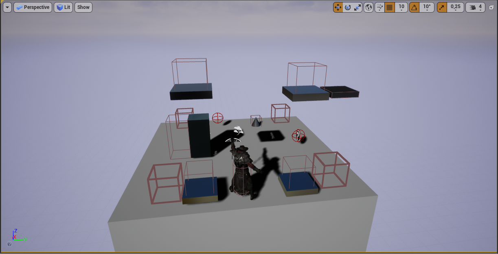

# Arcadia
Hello :wave: 
This prototype game is being developed in UE4. This is a ordinary adventure game, where you have to earn keys to advance to the next level. 
As I mentioned this is a prototype game that I stopped developing, because I think I can do it better now.

## Game mechanic
In the game you move like in a 2D game (left, right, up and down), to go to deep ( coordinate X ) you have to stand on one of the corners.
 

I made teleports, movable platforms, spikes, keys and a gate to the next level.
 
